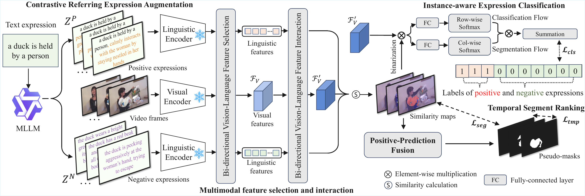

<div align="center">


<h1>Weakly-Supervised Referring Video Object Segmentation through Text Supervision</h1>

<p>
  Official implementation of the paper accepted by <strong>CVPR 2026 Findings ！</strong>
</p>

<p align="center">
  <a href="Figure.pdf">
    
  </a>
</p>

## Overview

WSRVOS studies weakly-supervised referring video object segmentation with only text supervision. The implementation in this repository follows the main components described in the paper:

- contrastive referring expression augmentation
- bi-directional vision-language feature selection
- bi-directional vision-language feature interaction
- instance-aware expression classification
- positive-prediction fusion
- temporal segment ranking

## Environment Setup

Recommended Python: `3.10+`

```bash
pip install -r requirements.txt
```

Notes:

- RoBERTa weights are loaded from `pretrained/pretrained_roberta` .
- Video Swin weights are loaded from `pretrained/pretrained_swin_transformer` .

## Dataset Preparation

Default config paths assume the repository is placed next to `RVOS_datasets/`:

```text
../RVOS_datasets/a2d_sentences
../RVOS_datasets/jhmdb_sentences
../RVOS_datasets/refer_youtube_vos
```

## Training / Evaluation 

Train on A2D-Sentences:

```bash
bash scripts/train_a2d.sh
```

Evaluate on A2D-Sentences:

```bash
bash scripts/eval_a2d.sh --checkpoint ./outputs/a2d/best.pth
```

Train on Ref-YouTube-VOS:

```bash
bash scripts/train_refytb.sh
```


